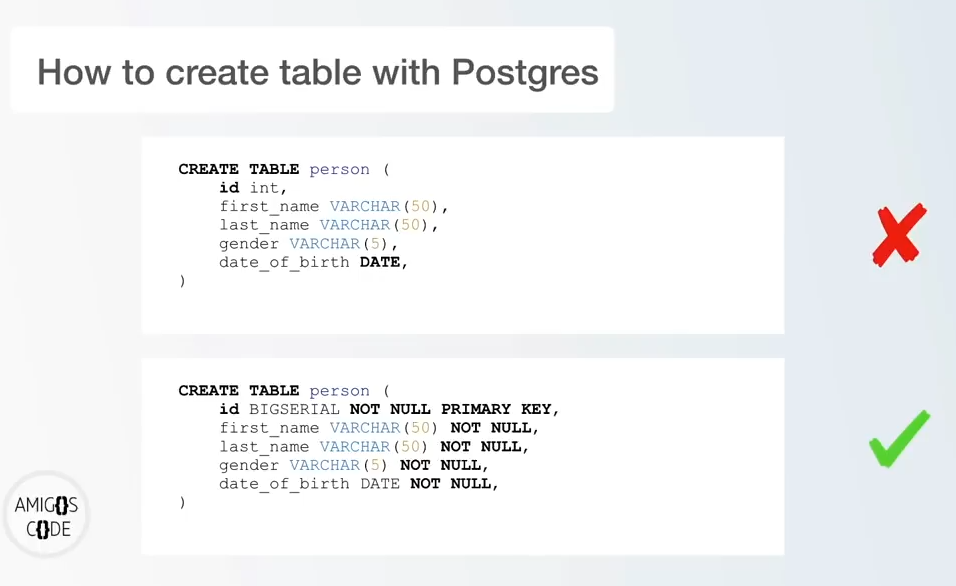
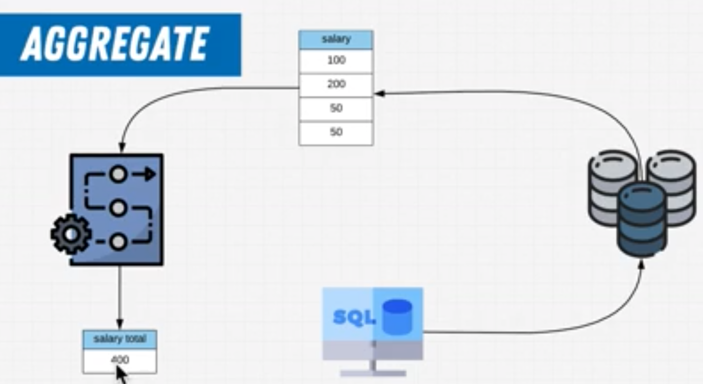

# writing PSQL commands

`CREATE EXTENSION`

## creating a new database**

`CREATE DATABASE database_name;`

`createdb database_name` 


## ways to connect to a database

1. `psql -h localhost -p 5432 -U teyenike database_name`
1. `\c database_name;`
1. \conninfo - showing you your current info
1. psql -U user database_name

**delete a database**

`DROP DATABASE database_name;`

**delete a table_name**

`DROP TABLE table_name;`

**create tables, DATA TYPES**

```sql
CREATE TABLE table_name (
  id INT,
  first_name VARCHAR(50),
  last_name VARCHAR(50),
  gender VARCHAR(6),
  date_of_birth TIMESTAMP
);
```

```sql
CREATE TABLE student (
student_id UUID PRIMARY KEY DEFAULT uuid_generate_v4(),
first_name VARCHAR(255) NOT NULL,
last_name VARCHAR(255) NOT NULL,
email VARCHAR(255) NOT NULL,
date_of_birth DATE NOT NULL
);
```

**CREATE AN EXTENSION**

These are pieces of software that allow you to expand what postgres can do or expand how certain processes run

`CREATE extension IF NOT EXISTS "uuid-ossp"`

**list of all tables in a database**

`\d`

**describe the actual table name**

`\d table_name;`

**show schemas**

`\dn`

**view roles**

\du

**Exit in the terminal**

`\q`

**show all databases**

`\l`

**Show help on backslash commands**

`\?`



**see just table**

`\dt`


## Insert data into a table

```sql
INSERT INTO person (first_name, last_name, gender, date_of_birth)
VALUES ("Teri", "Eyenike", "Male", date "1991-07-15");
```

Need some data for your project

[Mockaroo](https://mockaroo.com "Random data generator and API mocking tool")

## execute commands from file with `\i`

```sql
-- switch into the database

\i /Users/teyenike/folder_destination/file_name.sql
```

## ORDER BY

```SQL
SELECT *
FROM table_name
ORDER BY query ASC/DESC
;
```

## also the same as LIMIT

```sql
SELECT *
FROM person
OFFSET 5
FETCH FIRST 5
ROW ONLY
;
```

## IN

```sql
SELECT *
FROM person
WHERE country_of_birth IN ('China', 'France', 'Brazil')
;
```

## IGNORE CASE SENSITIVE

```sql
SELECT *
FROM person
WHERE country_of_birth ILIKE 'p%';
```

## GROUP BY

```sql
SELECT country_of_birth, COUNT(*)
FROM person
GROUP BY country_of_birth
ORDER BY country_of_birth ASC;
```

## GROUP BY HAVING

```sql
SELECT country_of_birth, COUNT(*)
FROM person
GROUP BY country_of_birth
HAVING COUNT(*) > 10
ORDER BY country_of_birth;
```

MAX, MIN, AVG

```sql
SELECT MAX(price)
FROM car

SELECT MIN(price)
FROM car

SELECT AVG(price)
FROM car

SELECT ROUND(AVG(price))
FROM car
```

COALESCE
_default value in case the first one is not present._

```SQL
SELECT COALESCE(email, 'Email not provided')
FROM person
```

HANDLE DIVISION BY ZERO

```sql
SELECT COALESCE(10 / NULLIF(0, 0), 0)
```

DATE

```sql
SELECT NOW();

SELECT NOW()::DATE;

SELECT NOW()::TIME;
```

ADDING AND SUBTRACTING WITH DATES

```sql
SELECT NOW() - INTERVAL '1 YEAR'

SELECT (NOW() + INTERVAL '10 MONTHS')::DATE;
```

EXTRACTING FIELDS

```sql
SELECT EXTRACT(MONTH FROM NOW());

SELECT EXTRACT(YEAR FROM NOW());

SELECT EXTRACT(DAY FROM NOW());

select extract(day from date '1991-07-15') as Day;

select extract(month from date '1991-07-15') as Month;

select extract(year from date '1991-07-15') as Year;

# DAY OF THE WEEK
SELECT EXTRACT(DOW FROM NOW());

SELECT EXTRACT(CENTURY FROM NOW());
```

# ROUND A DATE

to start from the beginning of the year 01-01

```sql
SELECT DATE_TRUNC('year', date '1991-07-15')
```

## AGE FUNCTION

```sql
# calculate the age of your birth from the actual date.
SELECT first_name,
      last_name,
      date_of_birth,
      AGE(NOW(), date_of_birth) AS age
      FROM person
      ;
```

## DELETE A RECORD FROM OUR TABLE

```sql
DELETE FROM person
WHERE id = 1;
```

## UPDATE A LIST ON TABLE

```sql
SELECT *
FROM person
UPDATE person SET email = 'teri@gmail.com'
WHERE id = 7
;

# OR update multiple data at once

UPDATE person SET
first_name='Achim',
last_name='Eyenike',
email = 'codegod@gmail.com'
WHERE id = 2007
```

## GENERATE CSV WITH POSTGRES

```SQL
\copy (SELECT *
  FROM table_name
  LEFT JOIN car
  ON car.id = person.car_id)
  TO '/Users/teyenike/Documents/result.csv' DELIMITER ',' CSV HEADER
```

```sql
/*
copy all the data from the employees
table into a csv file
*/
COPY (SELECT *
  FROM employees)
  TO '/Users/oterieyenike/Downloads/result.csv' DELIMITER ',' CSV HEADER
```

```sql
COPY capitals (id, country, capital)
FROM '/Users/oterieyenike/Downloads/capitals.csv'
DELIMITER ','
CSV HEADER;
```

## INSTALL EXTENSION IN POSTGRES

```sql
CREATE EXTENSION
IF NOT EXISTS
"uuid-assp"
```

## Understanding SQL and DataBases

Structured Query Language (SQL) is a query language that have existed since 1974. It's a powerful and easy to learn. SQL is what we would be using to query our database, Postgres. That is, Postgres uses SQL as its main query language. The best way to learn how to write a query language is not by using a Graphical User Interface (GUI) but rather we would be writing all our query in an interactive shell called psql or better still in our terminal or command line for Window users.

**What is a Database?**

A database is used to store, manipulate, and retrieve data stored in tables. SQL helps us to manage data held in a relational database.

**History and story of Data**
Database is a collection of data, a method for accessing and manipulating that data. Data is everywhere. Data is the most valueable commodity in the world. That is why big companies are very particular about this. Everyday in our world, we produce data whether it's drones with footages or location data, mobile phone apps, CCTV, websites.
To summarize, databases is simply to capture data and they are just computers comprising of the hardware (mechanical parts) and software (code written to query its data).
A database is a diskdrive, a way to store 1s and 0s on our computer.

**What Databases can solve**

- Automate tasks
- Making sure DB has integrity that is nobody can modify and/or delete the database.
- Combine databases.

**Fields that databases are useful to**

1. Product managers - always know the product they are working on.
2. Marketers - to find information to analyse business decisions, give insights on how to market the product.
3. Web Developers
4. Data Analyst
5. Data Engineers/Administrators

**DataBase Management System (DBMS)**

A software or program used to manage the database.

**Relational DataBase Management System**
This is more specific which is a subset of DBMS. Examples of RDBMS are PostgreSQL, MariaDB, ElasticSearch, SQLite, MySQL etc.

SQL is declarative language. Meaning it is stating what will happen. The original name for SQL was Sequel meaning Structured English Query Language. Technically in 1970s but formalized in 1980s.

**Terminologies**

**Columns**

Degree - A collection of columns.

Domain/Constraint - It is what a particular column can store.

Attributes - My domain has these attributes.

**Rows**

Rows - Inserting data into tables when creating rows.

Tuple/Row - A single record of data.

Tuples/rows - Multiple rows of data.

Cardinality - collection of rows/tuples.

**Primary and Foreign keys**

Primary key - It is a unique identifier

Foreign key - It is a key that would reference the primary key, the unique identifier of a different table. Relationship between two pieces of data.

**PS**: we link relationship by a primary key.

## Definition of Terms

OLTP - Online Transaction Processing. It support and drive the day to day business.

OLAP - Online Analytical Processing. It support analysis and drive future decisions.

# SQL Deep Dive

SQL commands are categorized into four categories.

- Data Definition Language
- Data Control Language
- Data Manipulation Language
- Data Query Language

## What is Select?

Select is a SQL command used to retrieve or get data filtering the information by row.

```sql
psql -U postgres -d Employees < employees.sql
```

## Renaming columns

```sql
SELECT column AS "<new name>" from table-name
```

## Column Concatenation

Make your data prettier/simpler and concatenate columns together.

When using the Concat function make use of single quote (represents text, character) and rename columns with the AS keyword.

Double quote represent column name, tables.
Single quote refers to characters.

```sql
SELECT CONCAT(emp_no, ' is a ', title)
AS "Employee Title"
FROM titles

OR

SELECT emp_no, CONCAT(first_name, ' ', last_name)
AS "full name"
FROM employees
```

## What is a Function

Set of steps that creates a single value.

**Types**

- Aggregate functions

It takes all its data and produce a single value.
https://www.postgresql.org/docs/12/functions-aggregate.html

Or

Operate on many records to produce one value.

Examples of some aggregate functions include, count(), sum(), max(), min(), avg()

```
SELECT count(colum_name) FROM employees;
```



- Scalar (non-aggregate functions)

Operate on each record independently

<!-- Comment -->

### Comment in SQL

[How To Make Comments](https://www.red-gate.com/simple-talk/sql/oracle/how-to-make-comments-the-most-important-code-you-write/)

```
--- single line comment

/*
multi-line comments
*/
```

## Filter on a single column with the `AND` keyword.

`AND`

```sql
SELECT col1, col2 FROM table_name
WHERE col1 = 'Expression' AND col2 = "Expression"
```

`AND and OR`

```sql
SELECT first_name, last_name, hire_date
 from employees where first_name = 'Georgi' AND last_name = 'Facello' AND hire_date = '1986-06-26'
 OR first_name = 'Bezalel' AND last_name = 'Simmel';
```

```sql
select firstname, lastname, gender, state
from customers where (state = 'OR' OR state = 'NY')
AND gender = 'F';
```

`WHERE` - Order of operation

`OR` - Start a new filter.

`AND` - chain together multiple criteria.

`NOT keyword`

filter everything But exclusion of this. Remove things from the result we don't want.

```sql
select age from customers where not age = 55;
```

<hr/>

## Commenting your queries

Describe what's happening in your written code.

## Operator Precedence

A statement having multiple operators is evaluated based on the priority of operators.

Parentheses -> multiplication/division -> Subtraction/addition -> NOT -> AND -> OR


`IS operator`

allows you to filter on values that are null, not null, true, or false.

## NULL Coalescing

Null value substitution - ability to replace null values to operate on the data.

Coalesce returns the first non-null value in a list.

## 3 valued logic

```sql
SELECT *
FROM customers
WHERE address2 IS NOT null;
```

```sql
SELECT coalesce(lastName, 'Empty'), * from "Student"
where (age IS NULL);
```

`BETWEEN AND`

Shorthan to match against a range of values. It is sensitive to the order of the arguments.

Why should we use it?

- Readable
- Maintainable

`IN keyword`

Filtering multiple values. Check if a value matches any value in a list of values.

```sql
SELECT COUNT(orderid)
FROM orders
WHERE customerid IN (7888, 1082, 12808, 9623)
```

```sql
SELECT COUNT(id)
FROM city
WHERE district IN ('Zuid-Holland', 'Noord-Brabant', 'Utrecht');
```

## Like - Partial Lookups

What if you don't know exactly what you're looking for? The LIKE keyword helps

**Pattern matching**

In order to use LIKE you need to build patterns to match. It happens with wildcards.

% - any number of characters

\_ one character after

| Pattern | Description                                                                |
| ------- | -------------------------------------------------------------------------- |
| '%x'    | Any value that ends with the letter x.                                     |
| 'x%'    | Any value that starts with the letter x.                                   |
| '%x%'   | Any value that has the letter x in any position.                           |
| 'x%z'   | Any value that starts with the letter x and ends with the letter z.        |
| '\_x%'  | Any value that has the letter x in the second position.                    |
| 'x*%*%' | Any value that starts with the letter x and has at least three characters. |

**Casting** is the act of changing something to something else.

```
first method: CAST(Salary AS text)

second method: salary::text
```

```sql
select * from customers
where CAST(zip as TEXT) LIKE '%2%'
```

**Random**

```sql
SELECT emp_no,
first_name,
EXTRACT (YEAR FROM AGE(birth_date)) as "age"
FROM employees
WHERE first_name ILIKE 'M%';
```

```sql
select coalesce(state, 'No State') as "State"
from customers
where phone::text
LIKE '302%';
```

<hr />

## Set the timezone for all of the session for the user you log in with.

```sql
ALTER USER user SET timezone = 'UTC'

SHOW timezone;
```

`user` here means the user on the mac

## Alter a table - add missing information to table

Change the SCHEMA of a table
Change the name of a table-level CONSTRAINT
Add and remove constraints
Change a column level constraint

```sql
ALTER TABLE <table_name>
ADD COLUMN <column_name> data_type

ALTER TABLE course
ALTER COLUMN teacher_id
SET NOT null;
```

## TimeStamps

Timestamp is a date with time and timezone info.

Postgresql uses the ISO-8601 as a standard in timezone formatting.

YYYY:MM:DDTHH:MM:SS

2020:09:09T11:13:54+02:00

```sql
SELECT NOW()::date;

SELECT CURRENT_DATE;

```

## Formatting Date Functions

```sql
SELECT TO_CHAR(CURRENT_DATE, 'dd/mm/yyyy');
```

`DISTINCT keyword`

It removes duplicates. The DISTINCT clause keeps one row for each group of duplicates.

`ORDER BY and ORDER BY LENGTH keyword`

## Sorting data

Sort data either ASCENDING (ASC) or DESCENDING (DESC) by columns. The command applies to the right most value and applies ASC to a column when not specified.

```sql
  SELECT first_name, last_name from employees ORDER BY first_name, last_name DESC;

  OR

  SELECT first_name, last_name from employees ORDER BY LENGTH(first_name), last_name ASC;
```

# ADVANCED SQL

**GROUP BY** clause

Summarize or aggregate data by groups. Why is it important?

To get in-depth information by group.

GROUP BY splits data groups or chunks so we can apply functions against the group rather than the entire table.

We use GROUP BY almost exclusively with aggregate functions. When we GROUP BY we apply the function per group, not on the entire data set.

PS. ORDER BY happens last of the GROUP BY clause.

```sql
SELECT select_list COUNT(select_list)
FROM select_list
GROUP BY select_list;

SELECT select_list, COUNT(select_list)
from select_list
where select_list = 'Expression'
group by select_list

```

**Things to remember**

Every column not in the GROUP BY clause must apply a function. GROUP BY is stricter than it looks. Why?

It's to reduce all records found for the matching GROUP to a single record.

GROUP BY utilizes a Split-Apply-Combine strategy.

**Split Phase**

Divide into groups with values.

**Apply Phase**

Apply aggregate against ungrouped columns.

**Combine Phase**

Combine groups with a single value into a single value.

## Order of precedence - order SQL to do something.

`FROM -> WHERE -> GROUP BY -> SELECT -> ORDER`

WHERE GROUP BY - after the WHERE clause

FROM GROUP BY - when there is no WHERE clause.

**HAVING** clause

The major difference between WHERE and HAVING clause is

WHERE applies filters to individual rows.

HAVING applies filters to a group as a whole.

## Order of precedence

`FROM -> WHERE -> GROUP BY -> HAVING -> SELECT -> ORDER`

<hr />
amigoscode

## What is a Relational Database?

Relational database is a relation between one or more tables. The major benefit of using a relational database is to help us split information in tables and have a relationship between them.

Before we go further into writing our first query, we need to know how data is stored.

1. Data is stored in tables
2. Columns
3. Rows

**PostgreSQL**

- Object-relatioal database management system
- Modern
- Open Source

**Other options**
Oracle database, MySql, Microsoft SQL Server

> AND: This operator makes sure both sides of the operator (both conditions) are true.
> • OR: This operator makes sure one side at least of the operator is true.
> • NOT: This operator makes sure that the condition following this operator is false.

## INNER JOIN

```sql
SELECT [Column List]
  FROM [Table 1] INNER JOIN [Table 2]
    ON [Table 1 Column Name] = [Table 2 Column Name]
WHERE [Condition]
```

<small>INNER in the query is optional</small>

## RIGHT JOIN

```sql
SELECT [Column List]
  FROM [Table 1] RIGHT OUTER JOIN [Table 2]
    ON [Table 1 Column Name] = [Table 2 Column Name]
WHERE [Condition]


SELECT [Column List]
  FROM [Table 1] RIGHT JOIN [Table 2]
    ON [Table 1 Column Name] = [Table 2 Column Name]
WHERE [Condition]
```

<small>OUTER in the query is optional</small>

## CROSS JOIN

```sql
SELECT [Column List]
  FROM [Table 1] CROSS JOIN [Table 2]
WHERE [Condition]
```

## UNION JOIN

The UNION operation is used to combine two queries.

```sql
SELECT [COLUMNS LIST] FROM [TABLE NAME]
UNION
SELECT [COLUMNS LIST] FROM [TABLE NAME]
```

However, the most important point to remember when we use the UNION operation is to ensure the following:
• Both query columns have similar data types
• Both query columns are in the same order

## Window of Functions

Window functions create a new column based on functions performed on a subset or window of data. To apply window of functions, the keyword `OVER` is necessary.

```psql
SELECT *, MAX(salary) OVER()
FROM salaries
WHERE salary < 70000;
```

Window of data, data that the query calculated out not what limit cut off. It is what the query returns itself.

Filter - of all of the data got, show me this.

limit - the query is still returning everything, cut it off at this number.

## PARTITION BY

Divide rows into groups to apply the function against (optional).

```psql
SELECT *, AVG(salary) OVER(PARTITION BY d.dept_name)
FROM salaries
JOIN dept_emp AS de USING (emp_no)
JOIN departments AS d USING (dept_no)
```

## ORDER BY

Order the results. Order By has a special property called `Framing`. It changes the frame of the window function.

```psql
SELECT *, COUNT(salary)
OVER(ORDER BY emp_no)
FROM salaries
```

# Exercises

```sql
/*
* DB: Store
* Table: orders
* Question: Get all orders from customers who live in Ohio (OH), New York (NY) or Oregon (OR) state
* ordered by orderid
*/

SELECT c.firstname, c.lastname, o.orderid FROM orders AS o
INNER JOIN customers AS c ON o.customerid = c.customerid
WHERE c.state IN ('NY', 'OH', 'OR')
ORDER BY o.orderid;


/*
* DB: Store
* Table: products
* Question: Show me the inventory for each product
*/

SELECT p.prod_id, i.quan_in_stock
FROM products as p
INNER JOIN inventory AS i oN p.prod_id = i.prod_id


/*
* DB: Employees
* Table: employees
* Question: Show me for each employee which department they work in
*/

SELECT e.first_name, dp.dept_name
FROM employees AS e
INNER JOIN dept_emp AS de ON de.emp_no = e.emp_no
INNER JOIN departments AS dp ON dp.dept_no = de.dept_no
```

## Group BY Exercise

```sql
/*
*  How many people were hired on did we hire on any given hire date?
*  Database: Employees
*  Table: Employees
*/

SELECT a.hire_date, COUNT(b.hire_date) as "amount"
FROM employees as a, employees as b
WHERE a.hire_date = b.hire_date
GROUP BY a.hire_date
ORDER BY "amount" DESC;

/*
*  Show me all the employees, hired after 1991, that have had more than 2 titles
*  Database: Employees
*/

SELECT e.emp_no, count(t.title) as "amount of titles"
FROM employees as e
JOIN titles as t USING(emp_no)
WHERE EXTRACT (YEAR FROM e.hire_date) > 1991
GROUP BY e.emp_no
HAVING count(t.title) > 2
ORDER BY e.emp_no;

/*
*  Show me all the employees that have had more than 15 salary changes that work in the department development
*  Database: Employees
*/

SELECT e.emp_no, count(s.from_date) as "amount of raises"
FROM employees as e
JOIN salaries as s USING(emp_no)
JOIN dept_emp AS de USING(emp_no)
WHERE de.dept_no = 'd005'
GROUP BY e.emp_no
HAVING count(s.from_date) > 15
ORDER BY e.emp_no;

/*
*  Show me all the employees that have worked for multiple departments
*  Database: Employees
*/

SELECT e.emp_no, count(de.dept_no) as "worked for # departments"
FROM employees as e
JOIN dept_emp AS de USING(emp_no)
GROUP BY e.emp_no
HAVING count(de.dept_no) > 1
ORDER BY e.emp_no;
```

## Window function exercise

```sql

/*
*  Show the population per continent
*  Database: World
*  Table: Country
*/
SELECT
  DISTINCT continent,
SUM(population) OVER w1 as"continent population"
FROM country
WINDOW w1 AS( PARTITION BY continent );
/*
*  To the previous query add on the ability to calculate the percentage of the world population
*  What that means is that you will divide the population of that continent by the total population and multiply by 100 to get a percentage.
*  Make sure you convert the population numbers to float using `population::float` otherwise you may see zero pop up
*
*  Database: World
*  Table: Country
*/
SELECT
  DISTINCT continent,
SUM(population) OVER w1 as"continent population",
  CONCAT(
      ROUND(
          (
SUM( population::float4 ) OVER w1 /
SUM( population::float4 ) OVER()
          ) * 100
      ),'%' ) as "percentage of population"
FROM country
WINDOW w1 AS( PARTITION BY continent );
/*
*  Count the number of towns per region
*
*  Database: France
*  Table: Regions (Join + Window function)
*/
SELECT
DISTINCT r.id,
r."name",
COUNT(t.id) OVER (
    PARTITION BY r.id
ORDER BY r."name"
) AS "# of towns"
FROM regions AS r
JOIN departments AS d ON r.code = d.region
JOIN towns AS t ON d.code = t.department
ORDER BY r.id;
```

## Conditional statements

```sql
/**
* Database: Store
* Table: products
* Create a case statement that's named "price class" where if a product is over 20 dollars you show 'expensive'
* if it's between 10 and 20 you show 'average'
* and of is lower than or equal to 10 you show 'cheap'.
*/

SELECT prod_id, title, price,
    CASE
      WHEN  price > 20 THEN 'expensive'
      WHEN  price <= 10 THEN  'cheap'
      WHEN  price BETWEEN 10 and 20  THEN 'average'
    END AS "price class"
FROM products
```

## NULLIF exercise

```sql

/*
* DB: Store
* Table: products
* Question: Show NULL when the product is not on special (0)
*/

SELECT prod_id, title, price,
NULLIF(special, 0) as "special"
FROM products
```

## View exercise

```sql
/*
*  Create a view "90-95" that:
*  Shows me all the employees, hired between 1990 and 1995
*  Database: Employees
*/

CREATE VIEW "90-95" AS
SELECT *
FROM employees as e
WHERE EXTRACT (YEAR FROM e.hire_date) BETWEEN 1990 AND 1995
ORDER BY e.emp_no;

/*
*  Create a view "bigbucks" that:
*  Shows me all employees that have ever had a salary over 80000
*  Database: Employees
*/

CREATE VIEW "bigbucks" AS
SELECT e.emp_no, s.salary
FROM employees as e
JOIN salaries as s USING(emp_no)
WHERE s.salary > 80000
ORDER BY s.salary;
```

## Subquery exercises

```sql

/* TRY TO WRITE THESE AS JOINS FIRST */
/*
* DB: Store
* Table: orders
* Question: Get all orders from customers who live in Ohio (OH), New York (NY) or Oregon (OR) state
* ordered by orderid
*/
SELECT c.firstname, c.lastname, o.orderid
FROM orders AS o, (
SELECT customerid, state, firstname, lastname
FROM customers
) AS c
WHERE  o.customerid = c.customerid AND
c.state IN ('NY', 'OH', 'OR')
ORDER BY o.orderid;
/*
* DB: Employees
* Table: employees
* Question: Filter employees who have emp_no 110183 as a manager
*/
SELECT emp_no, first_name, last_name
FROM employees
WHERE emp_no IN (
SELECT emp_no
FROM dept_emp
WHERE dept_no = (
SELECT dept_no
FROM dept_manager
WHERE emp_no = 110183
    )
)
ORDER BY emp_no
-- Written with JOIN
SELECT e.emp_no, first_name, last_name
FROM employees as e
JOIN dept_emp as de USING (emp_no)
JOIN dept_manager as dm USING (dept_no)
WHERE dm.emp_no = 110183
```
